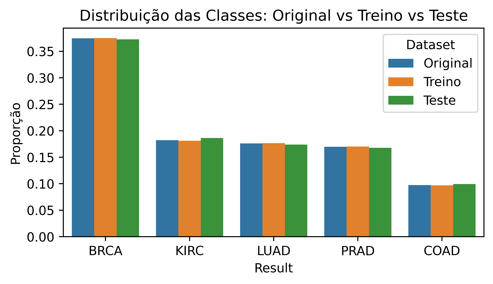
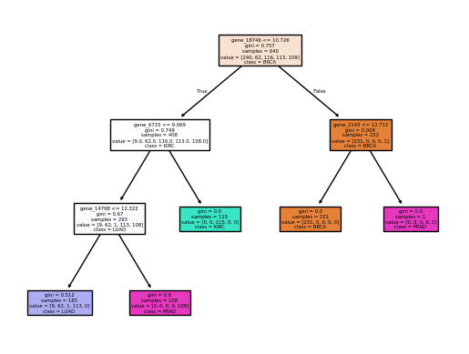
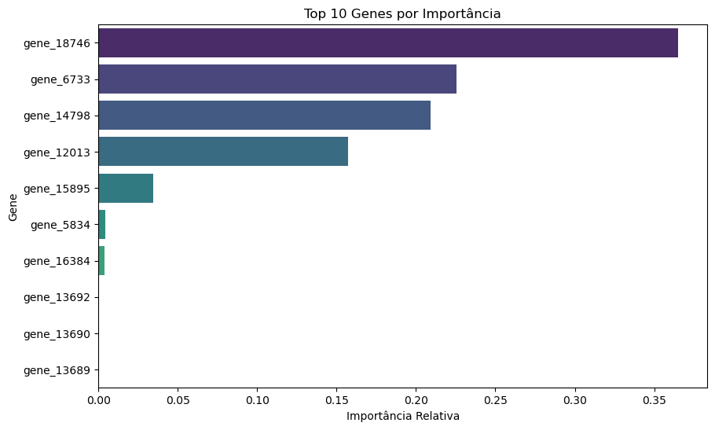

# 🧬 Classificação de Câncer via Expressão Gênica (RNA-Seq)

Este projeto aplica a framework **SEMMA** para analisar dados de sequenciamento de RNA (RNA-Seq) e classificar diferentes tipos de tumores cancerígenos utilizando Machine Learning. 

O objetivo principal é identificar padrões de expressão em milhares de genes para prever com precisão a classe do tumor (ex: BRCA, LUAD, PRAD, etc.).

---

## 🛠️ Metodologia SEMMA

O fluxo de trabalho foi estruturado seguindo as cinco etapas da metodologia SEMMA:

### 1. Sample (Aostragem)
* **Origem dos Dados:** Dataset de expressão gênica do Kaggle com dados de RNA-Seq.
* **Divisão de Dados:** Separação entre **80% para treino** e **20% para teste**.
* **Estratificação:** Utilização de `stratify=y` para manter a proporção das classes original nos conjuntos de treino e teste.

  

### 2. Explore (Exploração)
* **Análise Descritiva:** Cálculo de médias e medianas agrupadas por tipo de tumor para entender o comportamento das features.
* **Identificação de Missing:** Verificação de dados nulos no conjunto de treino.
* **Importância de Atributos:** Uso de uma **Decision Tree** para ranquear os genes mais importantes. Foram selecionadas as variáveis que acumulam **95% da importância** total para o modelo.

  
  

### 3. Modify (Modificação)
* **Label Encoding:** Conversão das etiquetas qualitativas (classes de câncer) em valores numéricos.
* **Discretização:** Aplicação do `DecisionTreeDiscretiser` para transformar as variáveis contínuas em intervalos baseados em árvores de decisão.
* **Feature Selection:** Filtragem do dataset para manter apenas as "best features" identificadas na etapa anterior.

### 4. Model (Modelagem)
* **Algoritmo:** Regressão Logística (`LogisticRegression`).
* **Treinamento:** O modelo foi ajustado utilizando as features transformadas e as classes codificadas.

### 5. Assess (Avaliação)
O desempenho foi validado tanto no treino quanto no teste através das métricas:
* **Acurácia:** Percentual de acerto global.
* **AUC (ROC):** Avaliação da capacidade de distinção entre as classes (estratégia Multi-class OVR).

---

## 📊 Tecnologias Utilizadas

* **Manipulação de Dados:** `pandas`
* **Machine Learning:** `scikit-learn`
* **Engenharia de Atributos:** `feature-engine`
* **Visualização:** `matplotlib`
